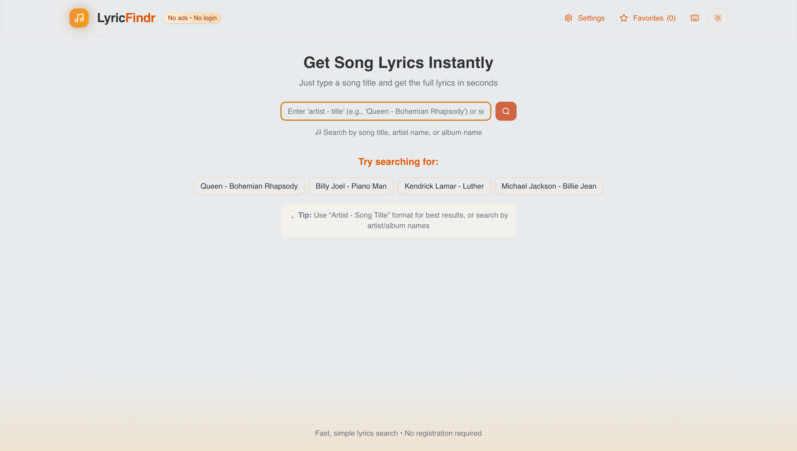
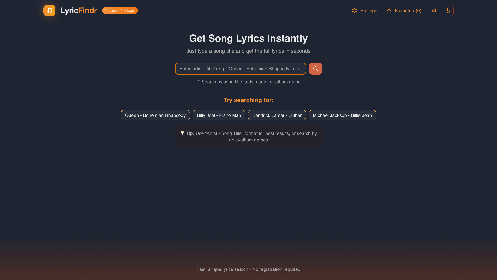

# 🎵 Lyric Findr

Lyric Findr is a lightweight and fast web app that lets you search and retrieve synced `.lrc` lyrics for any song using the [LRC Lib](https://lrclib.net/) API. Perfect for music lovers and karaoke fans.




---

## 🚀 Getting Started

### 1. Clone the repository

```bash
git clone https://github.com/PragTheDev/LyricFindr.git
cd lyric-findr
```

### 2. Run the development server

```
npm run dev
```

### 3. Use the app !!!
